# 02 — Architecture

## Stack (reuses your known stack)
- Backend: FastAPI + Uvicorn, SQLAlchemy 2 + Alembic, SQLite (dev) / PostgreSQL (prod), Pydantic v2, pydantic-settings, JWT (python-jose), slowapi
- ML: sentence-transformers (multilingual MiniLM / e5), FAISS (CPU), LightGBM, scikit-learn, SHAP (or custom reason codes), pandas
- Frontend: React 18 + Vite + TypeScript, Tailwind, Zustand, react-i18next, Recharts, vite-plugin-pwa
- Infra: Docker, docker-compose, Makefile, GitHub Actions
- Optional: Whisper (voice), IndicTrans2 / Bhashini for translation, LLM API for explanation text

## Flow

```mermaid
flowchart LR
  A[Student registers + consent] --> B[Adaptive assessment]
  B --> C[Profile vector: RIASEC + aptitude + constraints]
  C --> D[Hard filters: eligibility, NSQF level, age, budget, district]
  D --> E[Semantic retrieval FAISS over occupations/courses]
  E --> F[Re-rank LightGBM / weighted scorer]
  F --> G[Explain: reason codes + data sources]
  G --> H[Top-3 career cards]
  H --> I[Family Decision Room: weights, compare, vote]
  I --> J[Roadmap: course > centre > cert > job]
  J --> K[Counsellor dashboard + feedback loop]
```


## Folder tree
```
kaushalpath/
  backend/app/
    main.py  core/{config,security,logging}.py
    db/{base,session}.py  db/migrations/
    models/{user,student,assessment,occupation,course,centre,room,vote}.py
    schemas/*.py
    api/routes/{auth,students,assessment,recommend,rooms,compare,roadmap,counsellor,health}.py
    services/{assessment_svc,recommend_svc,room_svc,roadmap_svc,explain_svc,i18n_svc}.py
    ml/assessment/{riasec_items.json,adaptive.py,scoring.py}
    ml/retrieval/{embedder.py,index_builder.py,searcher.py}
    ml/ranking/{features.py,ranker.py,train.py}
    ml/explain/{reason_codes.py,templates_hi_en.json}
    data/{raw,processed,seed}
  backend/tests/{unit,integration}
  eval/{gold/personas.jsonl, scripts/run_eval.py, reports/}
  frontend/src/{pages,components,store,api,i18n,hooks}
  docs/ prompts/ infra/ scripts/
  docker-compose.yml  Makefile  .env.example  RULES.md  AGENTS.md
```

## Core data model (minimum)
- users(id, role[student|parent|counsellor|admin], lang, consent_at)
- students(user_id, age, edu_level, district, state, budget_band, relocate_ok, language)
- assessments(id, student_id, items_answered, riasec{R,I,A,S,E,C}, aptitude{num,verbal,spatial,mech}, confidence)
- occupations(id, name_en, name_hi, nco_code, onet_code, esco_uri, riasec{...}, nsqf_level, description, source)
- courses(id, occupation_id, name, nsqf_level, duration_months, min_edu, fee_inr, cert_body, source, is_demo)
- centres(id, course_id, name, district, state, lat, lon, source)
- market(occupation_id, state, avg_salary_inr, demand_index, year, source, is_demo)
- rooms(id, code, student_id, created_at) ; room_members(room_id, user_id, role)
- criteria_weights(room_id, user_id, cost, duration, salary, local_jobs, distance)
- votes(room_id, user_id, occupation_id, score)
- escalations(id, room_id, raised_by_user_id, student_id, occupation_id, reason, status, assigned_counsellor_id)
- counsellor_assignments(counsellor_id, student_id) ; counsellor_override(counsellor_id, student_id, occupation_id, note)
- objections(id, room_id, raised_by_user_id, occupation_id, topic[income|security|social|safety|other], sentiment[concern|neutral|positive], note)
- recommendations(id, student_id, occupation_id, rank, score, reasons_json, model_version)
- feedback(id, recommendation_id, helpful, chosen)

## API (v1)
POST /auth/register | /auth/login
POST /students/profile | GET /students/me
GET  /assessment/next | POST /assessment/answer | GET /assessment/result
POST /recommend  -> top-k with reasons
POST /rooms | POST /rooms/{code}/join | GET /rooms/{code} (snapshot: members/weights/votes/objections) | PUT /rooms/{code}/weights | POST /rooms/{code}/vote | GET /rooms/{code}/consensus
POST /rooms/{code}/compare  (occupation_ids -> normalised criteria + per-member totals + disagreement)
POST /rooms/{code}/objection  (topic + sentiment tag for a parental objection; feeds Phase 8 dashboard)
POST /rooms/{code}/escalate
GET  /roadmap/{occupation_id}?district=
GET  /counsellor/cohort | POST /counsellor/override
GET  /health | GET /meta/model-version
